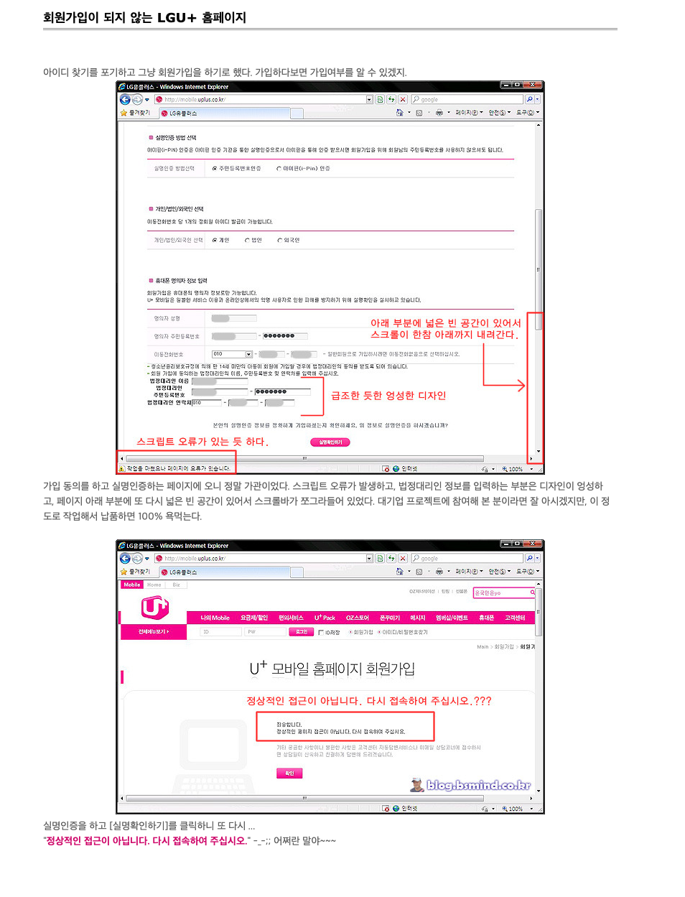
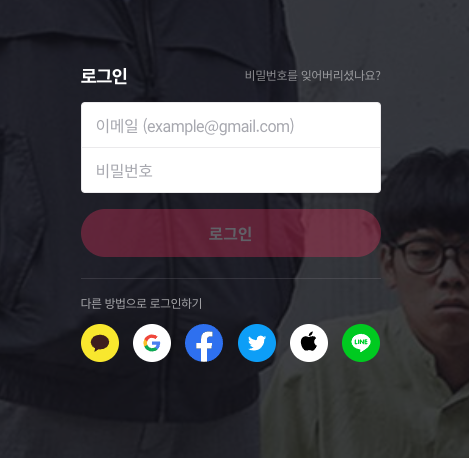

# OAuth2와 인증방식의 진화

## 사라진 회원가입

새로생긴 서비스/게임, 할인 혜택등의 다양한 이유로 새로운 사이트를 이용할 때, 우리는 언제나 회원가입이라는 허들을 넘어야 했습니다.
사이트마다 다른 아이디/패스워드 양식, 기억나지 않는 도로명 주소, 그 외에도 수 개의 질문들에 답해야 했습니다.
하지만 그 마저도 먼지만큼이라도 실수를 했다면 어김없이 우리는 깨끗이 지워진 화면에서 다시 시작해야 했습니다.
이렇게 수 번씩 회원가입을 시도하다보면, 높은 피로감에 중도 포기를 하기도 하였습니다.

하지만 어느새 부터인가 복잡한 회원가입이 사라지기 사작하고, 그 자리엔 구글이나 카카오와 같은 인증 서비스 제공자들의 아이콘이 생겼습니다.
그리고 우리는 한번의 아이콘 클릭으로 새로운 서비스를 시작할 수 있게 되었죠.

실로 엄청난 변화입니다. 유저들도 답답한 회원가입을 안해서 좋고, 서비스 사업자는 중도 이탈하는 유저를 잡아서 좋고.
모두가 좋은 이런 인증방식 정말 괜찮은 걸까요? 괜찮다면 어떻게 괜찮을 수 있었을까요?

## 비밀번호의 문제점

- TODO

## SAML의 등장

IT붐과 더불어 늘어나는 사이트개수 만큼 사용자들이 만들어야 할 계정의 개수는 늘어만 갔고,
이에 대한 불편을 없애고자 2002년에 비영리 컨소시엄 OASIS가 만든 SAML 1.0이 세상에 나오게 됩니다.
SAML은 기존에 하나의 사이트가 인증과 서비스 둘 다 가지고 있었던 것에서,
인증은 Idp(Identity Provider)에서 서비스는 SP(Service provider, Relying Party) 두 개의 서버로 나누어 설계하도록 합니다.

- Idp ( Identity Provider )
- SP ( Service Provider )

주요한 특징으로는 당시 지배적이였던 markup 포멧인 xml을 사용했다는 점과, 자체 암호화를 통해 http/soap 두개의 프로토콜에 대해 모두 제공 하였습니다.
마지막으로 가장 중요한 점은 하나의 계정로 여러 서비스를 이용가능하게 한 웹브라우저 SSO (Single Sign-on) 기능입니다 ( 웹브라우저의 쿠키 사용 ).

- xml format 사용
- 자체 암호화 ( SSL/TLS 없이도 가능 )
- SSO( Single Sign-on ) 제공

- User Agent는 보통 브라우저를 뜻합니다.

SAML 등장은 지금까지도 여러 사이트를 운영해야 했던 기업과 기관내에서 유용하게 사용되고습니다.
하지만 그 바람이 외부 사이트로 연결까지는 이어지지 못했습니다.
여러이유가 있었겠지만, SAML이 나왔을 당시 인증 방식을 노출하는 것이 보편화 되지 않았을테고,
또한 자체 인증 방식과 커스터바이징 된 프로필을 외부 타 서비스가 이식하는 것은 부담으로 이어졌을 것입니다.
당시 주를 이루던 xml포멧은 현재는 json 포멧이 주가 되면서 xml 포멧 기반의 프레임워크인 SAML은 더 쓰기 어려워 지게 되었습니다.

## OAuth의 등장

2006년 트위터와 Ma.gnolia는 같은시기에 OpenID를 사용하는 서비스를 개발하고 있었다. 이에 여러 개발자들이 이런 OpenID를 활용하여 API로 트위터나 Ma.gnolia 에 인증을 위임하는 방안에 대해서 논의하였습니다. 그 결과 아직은 API로 접근하여 인증을 위임하는 공개 표준이 없다는 결론에 이르렀습니다.
2007년 OAuth 인터넷 커뮤니티를 설립하고, 그 해 10월에 초안이 발표되었습니다. 그 후 OAuth는 여론에 힘을 얻어 2010년 IETF에서 OAuth 1.0 공식 표준안이 RFC 5849로 발표되었습니다. 2012년 OAuth 1.0이 웹 환경에서만 기술한 것에서 모바일 어플리케이션과 같은 다른 환경을 추가하고 다듬어서 가장 널리 알려진 OAuth2.0 프레임워크 ( RFC 6749 )를 발표했습니다.

주요한 특징으로는 현재 지배적인 markup 포멧인 json을 사용했다는 점과, 자체 암호화가 없고 ssl/tls에게 암호화를 위임했다.
또한 Access Token을 이용한 토큰을 이용한 인증방식을 사용하고 있고, 4가지 방식의 인증방법 ( Grant Type )을 선택해서 사용할 수 있다.
그리고 이러한 모든 서비스는 Endpoint를 통해 API 요청을 통해서 사용가능하다.

- json format 사용
- 자체 암호화 X ( SSL/TLS 필수 )
- 토큰을 이용한 인증 방식
- 4가지의 인증 방식 제공 ( Grant Type )

## 토큰을 이용한 인증 방식과 JWT ( Json Web Token ) - 한번만 증명 할 수 없을까?

- TODO

## 인가코드 인증 방식 - id/pw를 노출시키지 않고 인증 할 수 있을까?

- TODO

## References

- <https://blog.bsmind.co.kr/375> ( 회원가입이 되지 않는 LGU+ )
- <https://en.wikipedia.org/wiki/Security_Assertion_Markup_Language> ( SAML wiki )
- <https://auth0.com/intro-to-iam/saml-vs-oauth/> ( SAML vs OAuth )
- <https://ko.wikipedia.org/wiki/OAuth> ( OAuth wiki )
