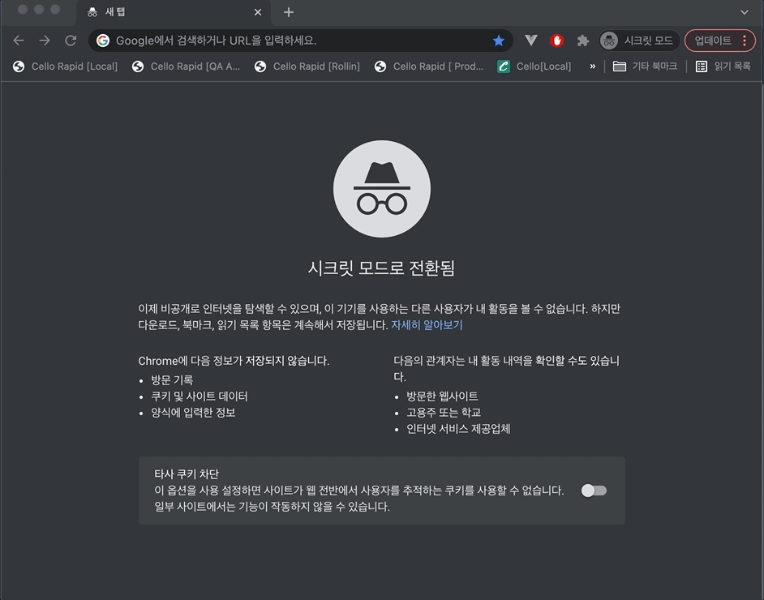
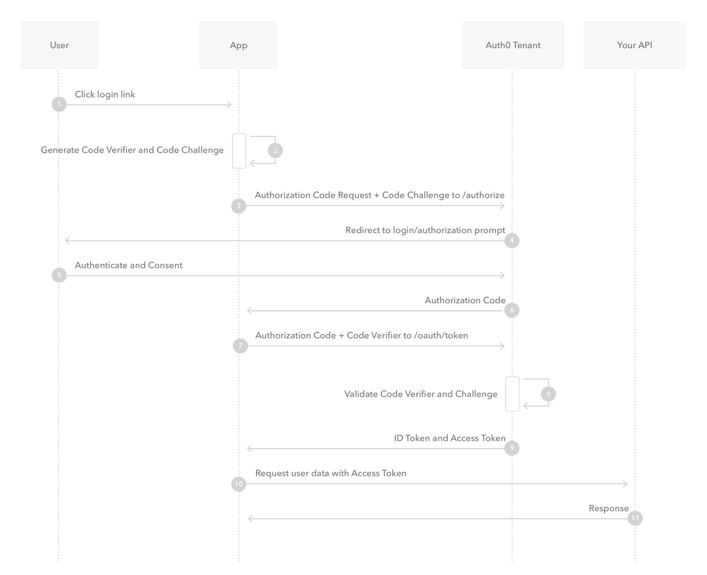
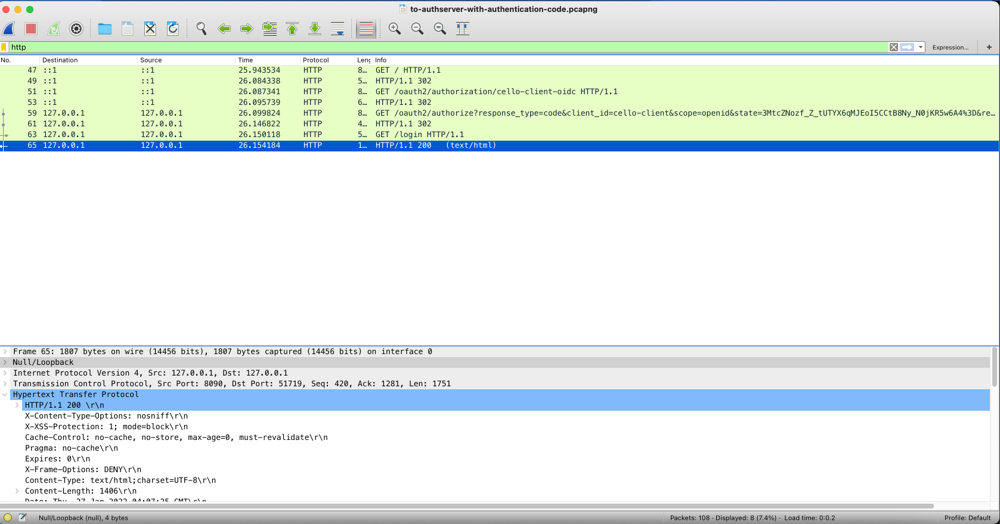
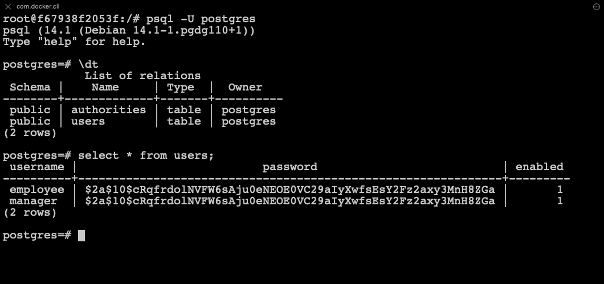
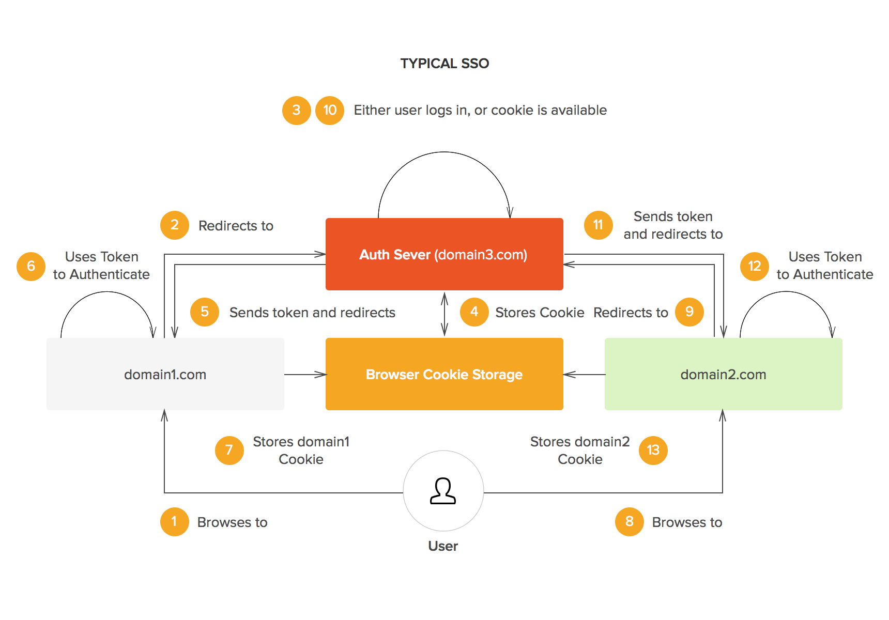
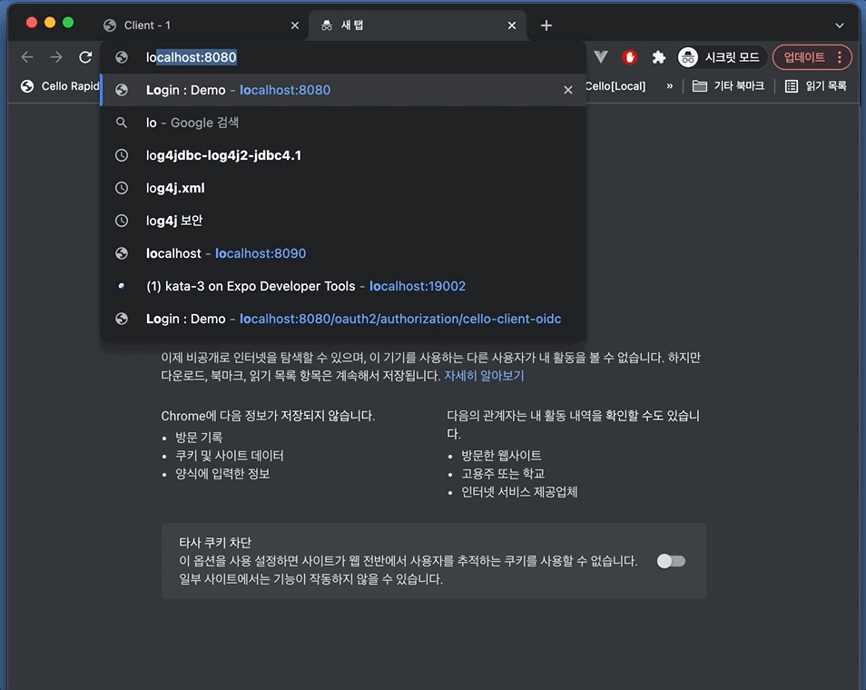

# oauth2-authentication-code-learn

## 서버 구성

- 인증서버 (IDP | IDentity Provider) : auth-server ( localhost:8090, auth-server:8090 )
- 클라이언트 서버 ( Client Server ) : client-server ( localhost: 8080 ), client-server-2 ( localhost: 9080 )
- 자원 서버 ( Resource Server ) : resource-server ( localhost: 8081 )

## 동작 화면

1. 클라이언트 서버 접근 ( localhost:8080 ) 
2. 세션이 없으므로 인증서버 ( auth-server:8090/login )의 로그인 화면으로 리다이렉션 
   - Authentication Code와 함께 리다이렉션 시킨다.
3. 로그인 성공 후, 엑세스 토큰과 함께 클라이언트 서버로 리다이렉션



### 흐름도



- User: 사용자
- App: 클라이언트 서버 ( Client Server )
- Auth0 Tenant: 인증서버 ( Auth Server )
- Your API: 자원 서버 ( Resource Server )


<!-- 
### 패킷

- 각 단계별 패킷을 "/wire-shark" 폴더에다 저장해두었다. -->



## UserDetails와 DB ( Postgresql ) 연결

### Docker 환경에서 Postgresql 실행

```bash
> docker volume create pgdata # 데이터를 저장할 볼륨을 생성한다.
> docker run -p 5432:5432 --name postgres -e POSTGRES_PASSWORD=1q2w3e4r -d -v pgdata:/var/lib/postgresql/data postgres
> docker exec -it postgres /bin/bash
```

```bash
\# psql -U postgres
\# CREATE USER arthur PASSWORD '1q2w3e4r' SUPERUSER;
\# CREATE DATABASE dbcom OWNER arthur;
\# GRANT ALL PRIVILEGES ON DATABASE dbcom TO arthur; # 특정 유저에게 데이터베이스에 접근가능한 권한 부여

\# \c dbcom arthur
```

#### USER 및 ROLE 테이블 생성 및 더미 데이터 삽입

```sql
CREATE TABLE USERS
(
  USERNAME VARCHAR(50) NOT NULL,
  PASSWORD VARCHAR(68) NOT NULL,
  ENABLED SMALLINT NOT NULL,
  PRIMARY KEY(USERNAME)
);

-- 더미 유저 ( manager, employee ) 생성
-- '$2a$10$cRqfrdolNVFW6sAju0eNEOE0VC29aIyXwfsEsY2Fz2axy3MnH8ZGa' 는 'pass'를 bcrpyt로 암호 알고리즘으로 인코딩 한 값이다.
INSERT INTO USERS (USERNAME, PASSWORD, ENABLED) VALUES('employee','$2a$10$cRqfrdolNVFW6sAju0eNEOE0VC29aIyXwfsEsY2Fz2axy3MnH8ZGa',1);
INSERT INTO USERS (USERNAME, PASSWORD, ENABLED) VALUES('manager','$2a$10$cRqfrdolNVFW6sAju0eNEOE0VC29aIyXwfsEsY2Fz2axy3MnH8ZGa',1);

-- 더미 권한 ( ROLE_USER, ROLE_EMPLOYEE, ROLE_MANAGER ) 생성
CREATE TABLE AUTHORITIES
(
  USERNAME VARCHAR(50) NOT NULL,
  AUTHORITY VARCHAR(68) NOT NULL,
  FOREIGN KEY (USERNAME) REFERENCES USERS(USERNAME)
);

INSERT INTO AUTHORITIES VALUES('employee','ROLE_EMPLOYEE');
INSERT INTO AUTHORITIES VALUES('employee','ROLE_USER');
INSERT INTO AUTHORITIES VALUES('manager','ROLE_MANAGER');
INSERT INTO AUTHORITIES VALUES('manager','ROLE_USER');
```

#### 더미 데이터 확인



#### JDBC 의존성 추가 & DB 정보 기입 ( pom.xml, application.yml )

```xml
<!-- JDBC ( Postgresql ) -->
<dependency>
  <groupId>org.springframework.boot</groupId>
  <artifactId>spring-boot-starter-data-jdbc</artifactId>
</dependency>
<dependency>
  <groupId>org.postgresql</groupId>
  <artifactId>postgresql</artifactId>
  <version>42.2.19</version>
</dependency>
<dependency>
  <groupId>org.bgee.log4jdbc-log4j2</groupId>
  <artifactId>log4jdbc-log4j2-jdbc4.1</artifactId>
  <version>1.16</version>
</dependency>
```

```yml
# datasource
spring:
  datasource:
    hikari:
      maximum-pool-size: 4
    url: jdbc:postgresql://localhost:5432/postgres
    username: arthur
    password: 1q2w3e4r
    driver-class-name: org.postgresql.Driver
```

#### DataSource 빈 생성

```java
@Configuration
public class JdbcConfig {
    final JdbcProperties jdbcProperties;

    public JdbcConfig(JdbcProperties jdbcProperties) {
        this.jdbcProperties = jdbcProperties;
    }

    @Bean
    public DataSource getDataSource() {
        DataSourceBuilder dataSourceBuilder = DataSourceBuilder.create();
        dataSourceBuilder.driverClassName(jdbcProperties.getDriverClassName()); // org.postgresql.Driver
        dataSourceBuilder.url(jdbcProperties.getUrl());                         // jdbc:postgresql://localhost:5432/postgres
        dataSourceBuilder.username(jdbcProperties.getUsername());               // arthur
        dataSourceBuilder.password(jdbcProperties.getPassword());               // 1q2w3e4r
        return dataSourceBuilder.build();
    }
}
```

#### PasswordEncoder 빈 생성

```java
@Bean
public PasswordEncoder passwordEncoder() {
    return new BCryptPasswordEncoder(10);
}
```

- PasswordEncoder 빈을 생성하게 될 경우, 이 빈으로 user의 password뿐만 아니라, client의 secret 값도 인코딩 하게 됩니다.

#### UserDetailService를 JdbcUserDetailsManager로 교체

- JdbcUserDetailManager는 UserDetailsManager를 상속 받았다.

```java
// DefaultSecurityConfig.java

@Bean
JdbcUserDetailsManager users() {
    return new JdbcUserDetailsManagerConfigurer<>()
            .dataSource(dataSource) // jdbc:postgresql://localhost:5432/postgres
            .withDefaultSchema()  // org/springframework/security/core/userdetails/jdbc/users.ddl
            .passwordEncoder(passwordEncoder()) // BCryptPasswordEncoder
            .getUserDetailsService();
}
```

## Custom Login Page 만들기

### Login.html 반환하는 프로세스


> LoginController를 대체해서 login.html 리턴하는 것을 커스텀한다. \
> "\*.html" 을 반환할 수도 있지만 기본적으로 제공해주는 csrf 값을 사용하기 편하도록 ".jsp" ( login.jsp ) 를 이용한다.

### JSP 환경 설정

#### 의존성 추가 & 설정 추가

```xml
<!-- pom.xml -->
<!-- JSTL -->
<dependency>
  <groupId>javax.servlet</groupId>
  <artifactId>jstl</artifactId>
</dependency>

<!-- JSP -->
<dependency>
  <groupId>org.apache.tomcat.embed</groupId>
  <artifactId>tomcat-embed-jasper</artifactId>
  <scope>provided</scope>
</dependency>
```

```yml
# application.yml

# jsp
spring.mvc.view.prefix: /WEB-INF/jsp/
spring.mvc.view.suffix: .jsp
```

#### login.jsp 파일 생성하기

##### 경로: main/webapp/WEB-INF/jsp/login.jsp

- Reference : <https://springhow.com/custom-form-login-in-spring-security/>

#### "/login" Controller생성 및 연결

```java
// controller | LoginController.java
@Controller
public class LoginController {
    private final String LOGIN_JSP = "login";

    @GetMapping("/login")
    public ModelAndView login(@RequestParam Map<String,String> allParams, Model model) {
        return new ModelAndView(LOGIN_JSP);
    }
}
```

```java
// DefaultSecurityConfig.java
@Bean
SecurityFilterChain defaultSecurityFilterChain(HttpSecurity http) throws Exception {
    http.authorizeRequests(authorizeRequests -> authorizeRequests
                    .anyRequest().authenticated()
    )
            .formLogin()
                .loginPage("/login")
                .permitAll();
    return http.build();
}
```

### 별첨) csrf 해제하기

```java
http.authorizeRequests(authorizeRequests -> authorizeRequests
                    .anyRequest().authenticated()
    )
            .formLogin()
                .loginPage("/login")
                .permitAll()
            .and()
                .csrf()
                .disable();
    return http.build();
```

## SSO ( Single Sign-On ) 인증 확인하기

### Single Sign-On 흐름도



- client1에서 로그인하면 client2에 접근하면 별도의 로그인 절차 없이 로그인된다.
- 인증서버 ( auth-server )가 직접 브라우저 쿠키에 세션 키값을 저장하고, 이용해 세션을 생성한다.



- Client Server 2에서 로그인.
- Client Server 1에 접근 => 별도의 로그인 절차 없이 로그인 되어있다.

## References

- <https://auth0.com/docs/get-started/authentication-and-authorization-flow/authorization-code-flow-with-proof-key-for-code-exchange-pkce>
- <https://springhow.com/custom-form-login-in-spring-security/>
- <https://docs.spring.io/spring-security/site/docs/5.4.2/reference/html5/>
- <https://www.javainterviewpoint.com/spring-security-jdbcuserdetailsmanager-example/>
- <https://velog.io/@jwpark06/SpringBoot%EC%97%90-JDBC%EB%A1%9C-Postgresql-%EC%97%B0%EB%8F%99%ED%95%98%EA%B8%B0>
- <https://auth0.com/blog/what-is-and-how-does-single-sign-on-work/>
